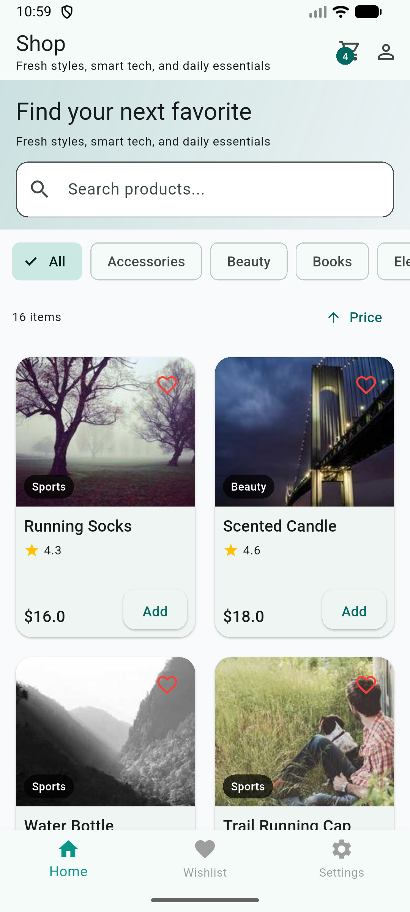
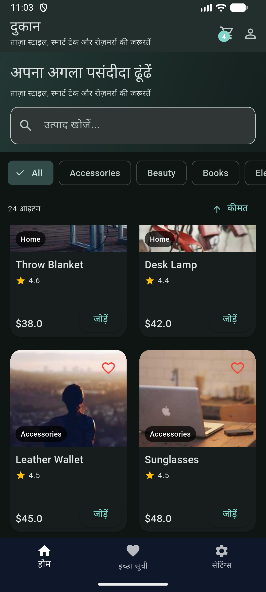
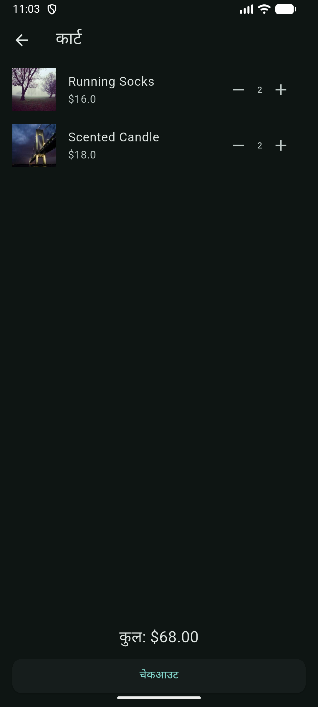
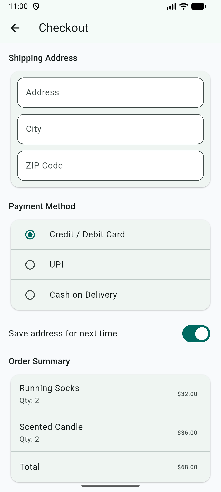
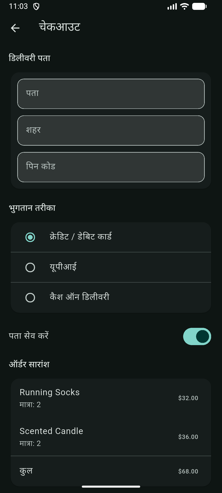
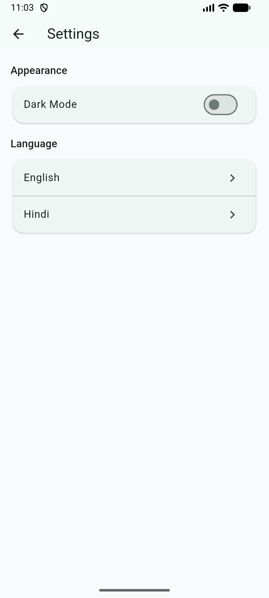
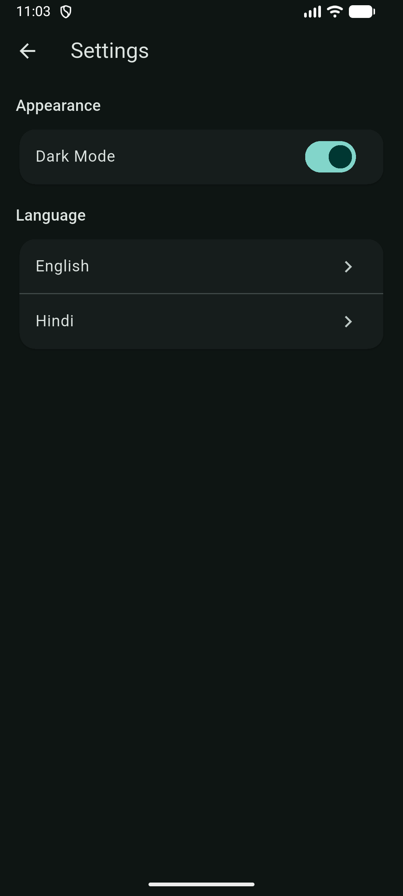

<h1 align="center">🛒 E-Commerce Flutter Application</h1>


A modular e-commerce mobile application built using **Flutter** and **Get**, focused on clean architecture, structured routing, and state management.

This project was built as a practice application to implement real-world architecture patterns and scalable folder structure.

---

## 🚀 Features

- 🔐 Authentication (Login / Signup)
- 🏠 Product listing with search, filtering, sorting
- 📦 Pagination (lazy loading)
- 🛍 Cart management with quantity updates
- ❤️ Wishlist functionality
- 💳 Checkout flow
- 📜 Order history & order details
- 📍 Address management (CRUD)
- 🌙 Light / Dark theme switching
- 🌐 Localization (English / Hindi)
- 🔒 Route protection using middleware
- 💾 Local persistence using GetStorage

---

## 🏗 Architecture

The application follows a modular and layered architecture:

```
lib/
 ├── app/
 │   ├── bindings/
 │   ├── data/
 │   │   ├── models/
 │   │   ├── repositories/
 │   │   └── services/
 │   ├── routes/
 │   ├── theme/
 │   └── translations/
 │
 ├── modules/
 │   ├── auth/
 │   ├── home/
 │   ├── cart/
 │   ├── checkout/
 │   ├── orders/
 │   ├── wishlist/
 │   ├── profile/
 │   └── settings/
 │
 └── widgets/
```

### Architectural Principles Used

- Repository Pattern (separation of data & UI layers)
- Modular feature-based folder structure
- Dependency Injection using Get Bindings
- Middleware-based route protection
- Reactive state management (Rx)

---

## 🧠 State Management

- Primary: **Get**
- Secondary: **BLoC (used in internship projects)**

Get is used for:
- Reactive state updates
- Dependency injection
- Navigation & route handling
- Middleware implementation

---

## 📦 Data Layer

- Models represent structured data.
- Repositories abstract service logic.
- Services handle:
  - Local storage (GetStorage)
  - Mock API product fetching
  - Auth simulation

This ensures UI remains independent of data source.

---

## 🔒 Route Protection

Custom middleware is used to:

- Restrict access to protected routes (e.g., checkout, orders)
- Redirect unauthenticated users to login
- Prevent logged-in users from accessing guest routes

---

## 💾 Persistence

Local storage is handled using **GetStorage**:

- Cart items
- Wishlist
- Orders
- Session state
- Saved addresses

---

## 🌍 Localization

Supports:

- English (en)
- Hindi (hi)

Translations managed via Get `Translations`.

---

## 🎨 Theme Management

- Light Mode
- Dark Mode
- Theme switching handled using a reactive `ThemeController`

---

## 🛠 Tech Stack

- Flutter
- Dart
- Get (GetX)
- GetStorage
- Firebase (Basic integration during internship)
- REST (Mocked service layer)

---

## 📌 Learning Objectives

This project was built to practice:

- Scalable Flutter architecture
- State management patterns
- Dependency injection
- Modular folder structure
- Route guards & middleware
- Persistent state handling

---

## 📷 Screenshots

<p align="center">
  
  
  
  
  
  
  
</p>

<p align="center">
  
  
  
  
  
</p>

---

## ▶️ How to Run

```
flutter pub get
flutter run
```

---

## 👨‍💻 Author

**Aleem Khan**  
Flutter Developer  
Thane, India  
